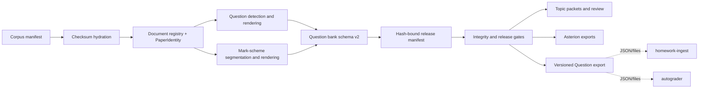

# Architecture

## Product boundary

The canonical product is schema-v2 `question_bank.json` plus question and
mark-scheme images derived from one `PaperIdentity` contract. A record cannot
pass mapping or downstream release gates when a required mark-scheme asset is
missing. Text and AI metadata never replace visual evidence.

`src/exam_bank/core/subject_contract.py` is the single component/family/course
authority. Paper 4 is `mechanics`/M1. Under the current syllabus, Paper 5 is
`stats`/S1 and Paper 6 is `stats`/S2. Before 2020, Paper 6 is S1 and Paper 5 is
the unsupported legacy M2 component, so year/session evidence is mandatory.
The shared `stats` storage family must be split by component at course-facing
boundaries; consumers must not guess a course when era evidence is absent.

The corpus manifest identifies each source document by canonical local path,
identity fields, document type, source and mirror URLs, SHA-256, and byte size.
`input/` is a hydrated cache, not repository source.

Compact sessions are one-to-one: `mYY` is February/March (`springYY`), `sYY`
is May/June (`summerYY`), and `wYY` is October/November (`winterYY`). Corpus
filename normalization uses first-page publisher text and retains a hash ledger;
runtime identity never collapses March and June.

## Advisory layers

Topic routing, taxonomy, difficulty, examiner evidence, mark events, OCR, and AI
enrichment are sidecars. Promoted review decisions live only under
`data/review/canonical/` and carry authority, source-run provenance, source
artifact hash, reviewer identity, and timestamp. Review runs and visual evidence
remain ignored working state.

Topic packets and Asterion are downstream projections. They may filter or group
canonical records but do not rewrite extraction truth. Student runtime requires
explicit reviewed/safe status and valid canonical assets.

`manifests/releases/question_bank_release_manifest.v1.json` binds the canonical
bank and durable topic-routing sidecar by SHA-256, byte size, schema, record
count, and exact question-ID set. `output/json` sidecar copies are caches, not a
second authority. P6 records remain review-only for topic filtering until an
approved P6 packet taxonomy is available.

## Extracted-system boundary

Rosters, student work, live email state, classroom state, message drafts,
submission reports, and ingest-handoff state are owned by
`../homework-ingest`. Draft and final grading results, rubric-scoring state, and
grading-provider configuration are owned by `../autograder`. Legacy ignored
roots remain protected here so an existing checkout cannot expose or delete
private pre-split data. Neither sibling imports exam-bank internals.

The file boundary is defined by versioned schemas under `schemas/`. Question
records are exported by `exam-bank data export-questions`; IDs are opaque and
asset paths are relative to the declared asset root. Advisory mark events are
not silently promoted into authoritative rubrics.

## Execution boundary

`exam-bank` exposes lazy-loaded domain namespaces so top-level help does not
import PDF, OCR, or AI stacks. Extraction resume keys include
source-document hashes, the effective configuration, pipeline version, and OCR
profile. Final records are sorted by canonical identity and written atomically.

`exam-bank extract run --workers N` is opt-in paper-level parallelism. Each
worker renders into an isolated staging root. The parent atomically promotes
artifacts, merges deterministic JSONL diagnostics, sorts records by canonical
identity, and writes the final JSON. Debug overlay mode remains single-worker
because its additional diagnostic streams are not yet partitioned.
