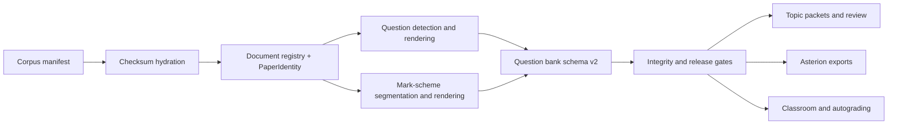

# Architecture

## Product boundary

The canonical product is schema-v2 `question_bank.json` plus question and
mark-scheme images derived from one `PaperIdentity` contract. A record cannot
pass mapping or downstream release gates when a required mark-scheme asset is
missing. Text and AI metadata never replace visual evidence.

The corpus manifest identifies each source document by canonical local path,
identity fields, document type, source and mirror URLs, SHA-256, and byte size.
`input/` is a hydrated cache, not repository source.

## Advisory layers

Topic routing, taxonomy, difficulty, examiner evidence, mark events, OCR, and AI
enrichment are sidecars. Promoted review decisions live only under
`data/review/canonical/` and carry authority, source-run provenance, source
artifact hash, reviewer identity, and timestamp. Review runs and visual evidence
remain ignored working state.

Topic packets and Asterion are downstream projections. They may filter or group
canonical records but do not rewrite extraction truth. Student runtime requires
explicit reviewed/safe status and valid canonical assets.

## Private platform boundary

Rosters, student work, live email state, classroom state, draft grades, and
submission reports are local-only and ignored. They are excluded from corpus
hydration, fixtures, releases, and promoted review decisions. Autograding and
student-facing exports remain fail-closed when required visual or reviewed
evidence is absent.

## Execution boundary

`exam-bank` exposes lazy-loaded domain namespaces so top-level help does not
import PDF, OCR, AI, email, and classroom stacks. Extraction resume keys include
source-document hashes, the effective configuration, pipeline version, and OCR
profile. Final records are sorted by canonical identity and written atomically.

`exam-bank extract run --workers N` is opt-in paper-level parallelism. Each
worker renders into an isolated staging root. The parent atomically promotes
artifacts, merges deterministic JSONL diagnostics, sorts records by canonical
identity, and writes the final JSON. Debug overlay mode remains single-worker
because its additional diagnostic streams are not yet partitioned.
